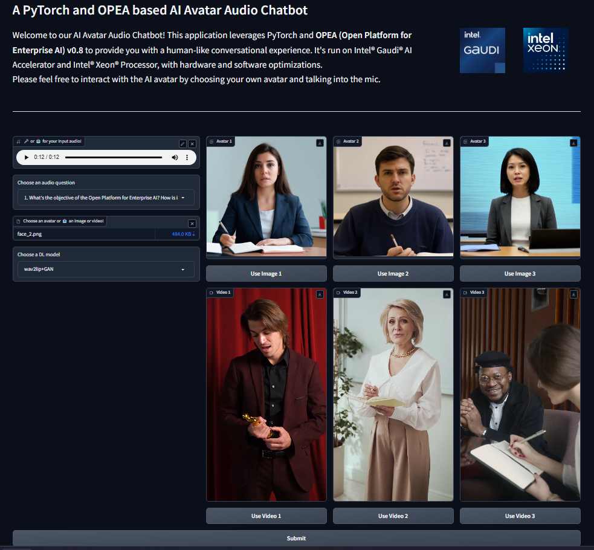

\# Build Mega Service of AvatarChatbot on AMD GPU


This document outlines the deployment process for a AvatarChatbot application utilizing the \[GenAIComps](https://github.com/opea-project/GenAIComps.git) microservice pipeline on Intel Xeon server.


\## 🚀 Build Docker images


\### 1. Source Code install GenAIComps


```bash

git clone https://github.com/opea-project/GenAIComps.git

cd GenAIComps

```


\### 2. Build ASR Image


```bash

docker build -t opea/whisper:latest --build-arg https\_proxy=$https\_proxy --build-arg http\_proxy=$http\_proxy -f comps/third\_parties/whisper/src/Dockerfile .


docker build -t opea/asr:latest --build-arg https\_proxy=$https\_proxy --build-arg http\_proxy=$http\_proxy -f comps/asr/src/Dockerfile .

```


\### 3. Build LLM Image


```bash

docker build --no-cache -t opea/llm-textgen:latest --build-arg https\_proxy=$https\_proxy --build-arg http\_proxy=$http\_proxy -f comps/llms/src/text-generation/Dockerfile .

```


\### 4. Build TTS Image


```bash

docker build -t opea/speecht5:latest --build-arg https\_proxy=$https\_proxy --build-arg http\_proxy=$http\_proxy -f comps/third\_parties/speecht5/src/Dockerfile .


docker build -t opea/tts:latest --build-arg https\_proxy=$https\_proxy --build-arg http\_proxy=$http\_proxy -f comps/tts/src/Dockerfile .

```


\### 5. Build Animation Image


```bash

docker build -t opea/wav2lip:latest --build-arg https\_proxy=$https\_proxy --build-arg http\_proxy=$http\_proxy -f comps/third\_parties/wav2lip/src/Dockerfile .


docker build -t opea/animation:latest --build-arg https\_proxy=$https\_proxy --build-arg http\_proxy=$http\_proxy -f comps/animation/src/Dockerfile .

```


\### 6. Build MegaService Docker Image


To construct the Mega Service, we utilize the \[GenAIComps](https://github.com/opea-project/GenAIComps.git) microservice pipeline within the `audioqna.py` Python script. Build the MegaService Docker image using the command below:


```bash

git clone https://github.com/opea-project/GenAIExamples.git

cd GenAIExamples/AvatarChatbot/

docker build --no-cache -t opea/avatarchatbot:latest --build-arg https\_proxy=$https\_proxy --build-arg http\_proxy=$http\_proxy -f Dockerfile .

```


Then run the command `docker images`, you will have following images ready:


1\. `opea/whisper:latest`

2\. `opea/asr:latest`

3\. `opea/llm-tgi:latest`

4\. `opea/speecht5:latest`

5\. `opea/tts:latest`

6\. `opea/wav2lip:latest`

7\. `opea/animation:latest`

8\. `opea/avatarchatbot:latest`


\## 🚀 Set the environment variables


Before starting the services with `docker compose`, you have to recheck the following environment variables.


```bash

export HF\_TOKEN=${HF\_TOKEN}

export host\_ip=$(hostname -I | awk '{print $1}')


export TGI\_SERVICE\_PORT=3006

export TGI\_LLM\_ENDPOINT=http://${host\_ip}:${TGI\_SERVICE\_PORT}

export LLM\_MODEL\_ID="Intel/neural-chat-7b-v3-3"


export ASR\_ENDPOINT=http://${host\_ip}:7066

export TTS\_ENDPOINT=http://${host\_ip}:7055

export WAV2LIP\_ENDPOINT=http://${host\_ip}:7860


export MEGA\_SERVICE\_HOST\_IP=${host\_ip}

export ASR\_SERVICE\_HOST\_IP=${host\_ip}

export TTS\_SERVICE\_HOST\_IP=${host\_ip}

export LLM\_SERVICE\_HOST\_IP=${host\_ip}

export ANIMATION\_SERVICE\_HOST\_IP=${host\_ip}


export MEGA\_SERVICE\_PORT=8888

export ASR\_SERVICE\_PORT=3001

export TTS\_SERVICE\_PORT=3002

export LLM\_SERVICE\_PORT=3007

export ANIMATION\_SERVICE\_PORT=3008


export DEVICE="cpu"

export WAV2LIP\_PORT=7860

export INFERENCE\_MODE='wav2lip+gfpgan'

export CHECKPOINT\_PATH='/usr/local/lib/python3.11/site-packages/Wav2Lip/checkpoints/wav2lip\_gan.pth'

export FACE="assets/img/avatar5.png"

\# export AUDIO='assets/audio/eg3\_ref.wav' # audio file path is optional, will use base64str in the post request as input if is 'None'

export AUDIO='None'

export FACESIZE=96

export OUTFILE="/outputs/result.mp4"

export GFPGAN\_MODEL\_VERSION=1.4 # latest version, can roll back to v1.3 if needed

export UPSCALE\_FACTOR=1

export FPS=10

```


Warning!!! - The Wav2lip service works in this solution using only the CPU. To use AMD GPUs and achieve operational performance, the Wav2lip image needs to be modified to adapt to AMD hardware and the ROCm framework.


\## 🚀 Start the MegaService


```bash

cd GenAIExamples/AvatarChatbot/docker\_compose/intel/cpu/xeon/

docker compose -f compose.yaml up -d

```


\## 🚀 Test MicroServices


```bash

\# whisper service

curl http://${host\_ip}:7066/v1/asr \\

&nbsp; -X POST \\

&nbsp; -d '{"audio": "UklGRigAAABXQVZFZm10IBIAAAABAAEARKwAAIhYAQACABAAAABkYXRhAgAAAAEA"}' \\

&nbsp; -H 'Content-Type: application/json'


\# asr microservice

curl http://${host\_ip}:3001/v1/audio/transcriptions \\

&nbsp; -X POST \\

&nbsp; -d '{"byte\_str": "UklGRigAAABXQVZFZm10IBIAAAABAAEARKwAAIhYAQACABAAAABkYXRhAgAAAAEA"}' \\

&nbsp; -H 'Content-Type: application/json'


\# tgi service

curl http://${host\_ip}:3006/generate \\

&nbsp; -X POST \\

&nbsp; -d '{"inputs":"What is Deep Learning?","parameters":{"max\_new\_tokens":17, "do\_sample": true}}' \\

&nbsp; -H 'Content-Type: application/json'


\# llm microservice

curl http://${host\_ip}:3007/v1/chat/completions\\

&nbsp; -X POST \\

&nbsp; -d '{"query":"What is Deep Learning?","max\_tokens":17,"top\_k":10,"top\_p":0.95,"typical\_p":0.95,"temperature":0.01,"repetition\_penalty":1.03,"streaming":false}' \\

&nbsp; -H 'Content-Type: application/json'


\# speecht5 service

curl http://${host\_ip}:7055/v1/tts \\

&nbsp; -X POST \\

&nbsp; -d '{"text": "Who are you?"}' \\

&nbsp; -H 'Content-Type: application/json'


\# tts microservice

curl http://${host\_ip}:3002/v1/audio/speech \\

&nbsp; -X POST \\

&nbsp; -d '{"text": "Who are you?"}' \\

&nbsp; -H 'Content-Type: application/json'


\# wav2lip service

cd ../../../..

curl http://${host\_ip}:7860/v1/wav2lip \\

&nbsp; -X POST \\

&nbsp; -d @assets/audio/sample\_minecraft.json \\

&nbsp; -H 'Content-Type: application/json'


\# animation microservice

curl http://${host\_ip}:3008/v1/animation \\

&nbsp; -X POST \\

&nbsp; -d @assets/audio/sample\_question.json \\

&nbsp; -H "Content-Type: application/json"


```


\## 🚀 Test MegaService


```bash

curl http://${host\_ip}:3009/v1/avatarchatbot \\

&nbsp; -X POST \\

&nbsp; -d @assets/audio/sample\_whoareyou.json \\

&nbsp; -H 'Content-Type: application/json'

```


If the megaservice is running properly, you should see the following output:


```bash

"/outputs/result.mp4"

```


The output file will be saved in the current working directory, as `${PWD}` is mapped to `/outputs` inside the wav2lip-service Docker container.


\## Gradio UI


```bash

cd $WORKPATH/GenAIExamples/AvatarChatbot

python3 ui/gradio/app\_gradio\_demo\_avatarchatbot.py

```


The UI can be viewed at http://${host\_ip}:7861  

  

In the current version v1.3, you need to set the avatar figure image/video and the DL model choice in the environment variables before starting AvatarChatbot backend service and running the UI. Please just customize the audio question in the UI.

\\\*\\\* We will enable change of avatar figure between runs in v2.0


\## Troubleshooting


```bash

cd GenAIExamples/AvatarChatbot/tests

export IMAGE\_REPO="opea"

export IMAGE\_TAG="latest"

export HF\_TOKEN=<your\_hf\_token>


test\_avatarchatbot\_on\_xeon.sh

```

