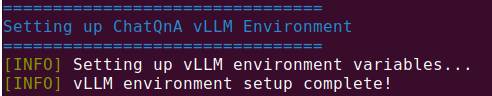
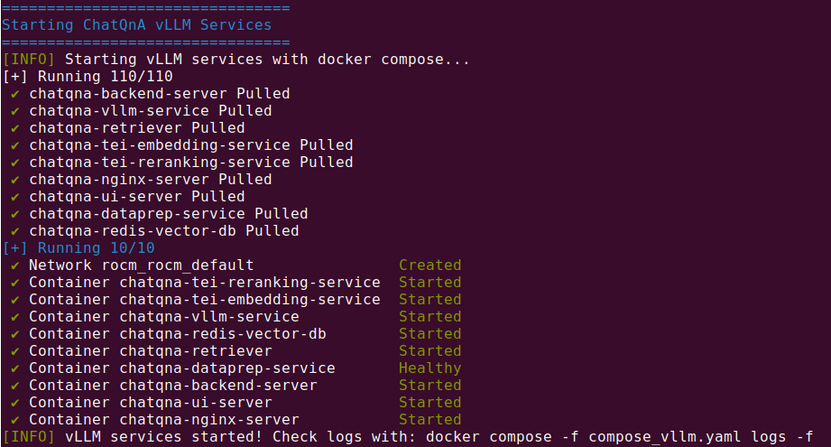
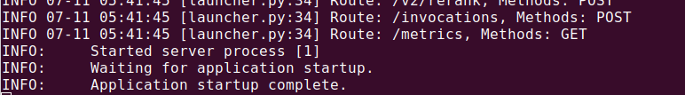
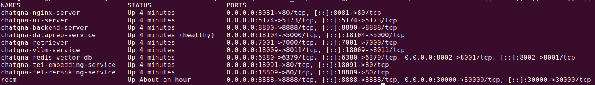
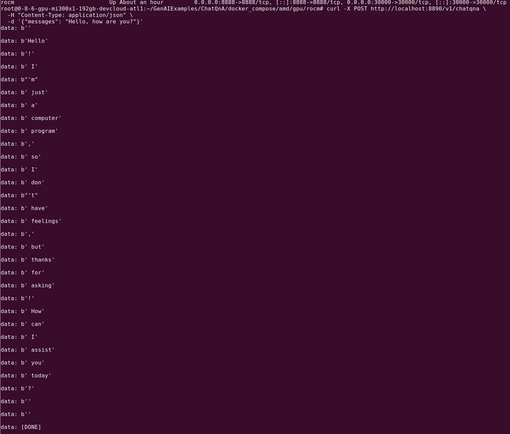
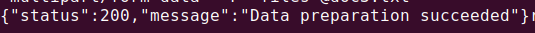
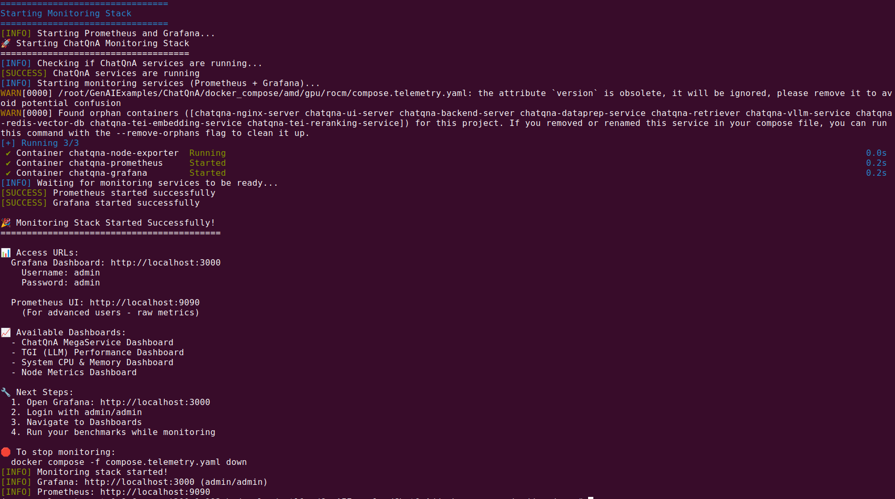

# ChatQnA vLLM Deployment and Performance Evaluation Tutorial

## Table of Contents
1. [Overview](#overview)
2. [Prerequisites](#prerequisites)
3. [System Architecture](#system-architecture)
4. [Deployment Guide](#deployment-guide)
5. [Performance Evaluation](#performance-evaluation)
6. [Monitoring and Troubleshooting](#monitoring-and-troubleshooting)
7. [Advanced Configuration](#advanced-configuration)
8. [Troubleshooting](#troubleshooting)

## Overview

ChatQnA is a Retrieval-Augmented Generation (RAG) system that combines document retrieval with LLM inference. This tutorial provides a comprehensive guide for deploying ChatQnA using vLLM on AMD GPUs with ROCm support, and performing pipeline performance evaluation.

### Key Features
- **vLLM Integration**: LLM serving with optimized inference on AMD Instinct GPUs
- **AMD GPU Support**: ROCm-based GPU acceleration
- **Vector Search**: Redis-based document retrieval
- **RAG Pipeline**: Complete question-answering system
- **Performance Monitoring**: Built-in metrics and evaluation tools

## Prerequisites
- **AMD Developer Cloud**: 1xMI300X GPU / 192 GB VRAM / 20 vCPU / 240 GB RAM Droplet
- **Hugging Face Token**: For model access

## System Architecture

### Service Components

The following is the complete system architecture diagram.

**Architecture Overview:**

```
┌───────────────────────────────────────────────────────────────────────────────────┐
│                               EXTERNAL ACCESS                                     │
│                                                                                   │
│   ┌─────────────────┐    ┌─────────────────┐    ┌─────────────────────────────┐   │
│   │   Web Browser   │    │   API Clients   │    │      Monitoring Tools       │   │
│   │                 │    │                 │    │    (Grafana, Prometheus)    │   │
│   └─────────────────┘    └─────────────────┘    └─────────────────────────────┘   │
│           │                       │                           │                   │
│           │                       │                           │                   │
│           ▼                       ▼                           ▼                   │
│   ┌─────────────────┐    ┌─────────────────┐    ┌─────────────────────────────┐   │
│   │   Nginx Proxy   │    │   Backend API   │    │        Redis Insight        │   │
│   │   (Port 8081)   │    │   (Port 8890)   │    │         (Port 8002)         │   │
│   └─────────────────┘    └─────────────────┘    └─────────────────────────────┘   │
│           │                       │                           │                   │
│           │                       │                           │                   │
│           ▼                       ▼                           ▼                   │
│   ┌─────────────────┐    ┌─────────────────┐    ┌─────────────────────────────┐   │
│   │   Frontend UI   │    │     Backend     │    │   Redis Vector Database     │   │
│   │   (Port 5174)   │    │     Server      │    │         (Port 6380)         │   │
│   │   (React App)   │    │    (FastAPI)    │    │      (Vector Storage)       │   │
│   └─────────────────┘    └─────────────────┘    └─────────────────────────────┘   │
│                                   │                           │                   │
│                                   │                           │                   │
│                                   ▼                           ▼                   │
│  ┌─────────────────────────────────────────────────────────────────────────────┐  │
│  │                             RAG PIPELINE                                    │  │
│  │                                                                             │  │
│  │  ┌───────────────────┐ ┌─────────────────────┐ ┌─────────────────────────┐  │  │
│  │  │ Retriever Service │ │TEI Embedding Service│ │  TEI Reranking Service  │  │  │
│  │  │                   │ │                     │ │                         │  │  │
│  │  │   (Port 7001)     │ │    (Port 18091)     │ │      (Port 18809)       │  │  │
│  │  │                   │ │                     │ │                         │  │  │
│  │  │ • Vector Search   │ │ • Text Embedding    │ │ • Document Reranking    │  │  │
│  │  │ • Similarity      │ │ • BGE Model         │ │ • Relevance Scoring     │  │  │
│  │  │   Matching        │ │ • CPU Inference     │ │ • CPU Inference         │  │  │
│  │  └───────────────────┘ └─────────────────────┘ └─────────────────────────┘  │  │
│  │            │                      │                         │               │  │
│  │            │                      │                         │               │  │
│  │            ▼                      ▼                         ▼               │  │
│  │  ┌───────────────────────────────────────────────────────────────────────┐  │  │
│  │  │                           vLLM Service                                │  │  │
│  │  │                           (Port 18009)                                │  │  │
│  │  │                                                                       │  │  │
│  │  │                  • High-Performance LLM Inference                     │  │  │
│  │  │                  • AMD GPU Acceleration (ROCm)                        │  │  │
│  │  │                  • Qwen2.5-7B-Instruct Model                          │  │  │
│  │  │                  • Optimized for Throughput & Latency                 │  │  │
│  │  │                  • Tensor Parallel Support                            │  │  │
│  │  └───────────────────────────────────────────────────────────────────────┘  │  │
│  └─────────────────────────────────────────────────────────────────────────────┘  │
│                                      │                                            │
│                                      │                                            │
│                                      ▼                                            │
│  ┌─────────────────────────────────────────────────────────────────────────────┐  │
│  │                            DATA PIPELINE                                    │  │
│  │                                                                             │  │
│  │  ┌─────────────────┐    ┌─────────────────┐    ┌─────────────────────────┐  │  │
│  │  │   Dataprep      │    │   Model Cache   │    │   Document Storage      │  │  │
│  │  │   Service       │    │   (./data)      │    │   (Redis Vector DB)     │  │  │
│  │  │   (Port 18104)  │    │                 │    │                         │  │  │
│  │  │                 │    │ • Downloaded    │    │ • Vector Embeddings     │  │  │
│  │  │ • Document      │    │   Models        │    │ • Metadata Index        │  │  │
│  │  │   Processing    │    │ • Model Weights │    │ • Full-Text Search      │  │  │
│  │  │ • Text          │    │ • Cache Storage │    │ • Similarity Search     │  │  │
│  │  │   Extraction    │    │ • Shared Volume │    │ • Redis Stack           │  │  │
│  │  └─────────────────┘    └─────────────────┘    └─────────────────────────┘  │  │
│  └─────────────────────────────────────────────────────────────────────────────┘  │
└───────────────────────────────────────────────────────────────────────────────────┘
```

**Additional Services:**
- **Dataprep Service** (Port 18104): Document processing and ingestion
- **Redis Insight** (Port 8002): Database monitoring interface
- **Model Cache** (./data): Shared volume for model storage

### Data Flow
1. **User Input**: Question submitted via frontend
2. **Embedding**: Question converted to vector using TEI service
3. **Retrieval**: Similar documents retrieved from Redis vector database
4. **Reranking**: Retrieved documents reranked for relevance
5. **LLM Inference**: vLLM generates answer using retrieved context
6. **Response**: Answer returned to user via frontend

## Deployment Guide

### Step 1: Pull source code from GitHub 

Open Platform for Enterprise AI (OPEA):
```bash
git clone https://github.com/opea-project/GenAIExamples.git
```
One click deployment scripts for the use case:
```bash
git clone https://github.com/Yu-amd/LaunchPad.git
```

The LaunchPad project uses the same hierarchy as OPEA project. You need to copy the scripts and yaml files from the directory: LaunchPad/GenAIExamples/ChatQnA/docker_compose/amd/gpu/rocm/ to the corresponding directory in OPEA folder:
```bash
# Copy necessary scrips and configuration files to the OPEA directory
cp *.sh *.yaml /path/to/OPEA/GenAIExamples/ChatQnA/docker_compose/amd/gpu/rocm/
```

### Step 2: Environment Setup

Navigate to the OPEA deployment directory:
```bash
cd /path/to/GenAIExamples/ChatQnA/docker_compose/amd/gpu/rocm
```
Set up your Hugging Face token and environment:
```bash
# Edit the following line in set_env_vllm.sh with your Hugging Face Token
export CHATQNA_HUGGINGFACEHUB_API_TOKEN="your hugging face token"

# Save and exit the file
# Source the vLLM environment configuration
source set_env_vllm.sh
```

### Step 3: Deploy Services

#### Option A: Using the Unified Script (Recommended)
```bash
# Setup vLLM environment
./run_chatqna.sh setup-vllm



# Start vLLM services
./run_chatqna.sh start-vllm



# Check service status
./run_chatqna.sh status

# Check chatqna-vllm-service status
docker logs -f chatqna-vllm-service



```

#### Option B: Manual Deployment
```bash
# Source environment variables
source set_env_vllm.sh

# Start all services
docker compose -f compose_vllm.yaml up -d

# Check service status
docker ps
```

### Step 4: Verify Deployment

Check that all services are running:
```bash
# Check running containers
docker ps --format "table {{.Names}}\t{{.Status}}\t{{.Ports}}"



# Test backend API
curl -X POST http://localhost:8890/v1/chatqna \
  -H "Content-Type: application/json" \
  -d '{"messages": "Hello, how are you?"}'



# Access the web interface
# Open browser: http://replace_with_your_public_IP:5174
```
You can find your public IP on the droplet information page, or you can use this command
```bash
hostname -I | awk '{print $1}'
```

### Step 5: Upload Documents

Upload documents for the RAG system:
```bash
# Create a text file
echo "Your document content here" > document.txt

# Upload the file
curl -X POST http://localhost:18104/v1/dataprep/ingest \
  -H "Content-Type: multipart/form-data" \
  -F "files=@document.txt"

# Verify the upload worked
# Check if the document was indexed
curl -X POST http://localhost:18104/v1/dataprep/get \
  -H "Content-Type: application/json" \
  -d '{"index_name": "rag-redis"}'

# For multiple documents
# Create multiple files
echo "Document 1 content" > doc1.txt
echo "Document 2 content" > doc2.txt

# Upload multiple files
curl -X POST http://localhost:18104/v1/dataprep/ingest \
  -H "Content-Type: multipart/form-data" \
  -F "files=@doc1.txt" \
  -F "files=@doc2.txt"


```

## Performance Evaluation

### Overview

Performance evaluation helps you understand:
- **Throughput**: Requests per second
- **Latency**: Response time
- **Accuracy**: Answer quality
- **Resource Usage**: CPU, GPU, memory utilization

### Step 1: Setup Evaluation Environment

```bash
# Pull from OPEA GitHub so GenAIExamples and GenAIEval are in the same directory
git clone https://github.com/opea-project/GenAIEval.git

# Navigate to evaluation directory
cd /path/to/GenAIEval

# Copy chatqna scripts from the LaunchPad directory
cp /path/to/LaunchPad/GenAIEval/evals/benchmark/* /path/to/GenAIEval/evals/benchmark/

# Install dependency
apt install python3.12-venv

# Create virtual environment
python3 -m venv opea_eval_env
source opea_eval_env/bin/activate

# Install evaluation dependencies
pip install -r requirements.txt
pip install -e .
```

### Step 2: Run Basic Evaluation

#### Using the Automated Script
```bash
# Navigate back to GenAIExamples/ChatQnA/docker_compose/amd/gpu/rocm/
cd /path/to/GenAIExamples/ChatQnA/docker_compose/amd/gpu/rocm/

# Run vLLM evaluation
./run_chatqna.sh vllm-eval

# Replace gated model from aistress.py
cp /path/to/LaunchPad/GenAIEval/evals/benchmark/stresscli/locust/aistress.py /path/to/GenAIEval/evals/benchmark/stresscli/locust/

# Check for existing processes
ps aux | grep -E "(locust|benchmark)" | grep -v grep
# Kill existing processes if found
pkill -f locust
pkill -f benchmark
# Run vLLM full benchmark
./run_chatqna.sh vllm-benchmark
```

### Step 3: Performance Metrics

#### Throughput Testing
```bash
# Install dependency
apt install apache2-utils

# Create a complex test file
echo "{"messages": "Can you provide a detailed explanation of how neural networks work, including the concepts of forward propagation, backpropagation, and gradient descent? Also explain how these concepts relate to deep learning and why they are important for modern AI systems."}" > test_data.json

# Test concurrent requests
ab -n 100 -c 10 -p test_data.json -T application/json \
  http://localhost:8890/v1/chatqna
```

#### Latency Testing
```bash
# Create curl-format.txt with the following content:
     time_namelookup:  %{time_namelookup}\n
        time_connect:  %{time_connect}\n
     time_appconnect:  %{time_appconnect}\n
    time_pretransfer:  %{time_pretransfer}\n
       time_redirect:  %{time_redirect}\n
  time_starttransfer:  %{time_starttransfer}\n
                     ----------\n
          time_total:  %{time_total}\n
          http_code:  %{http_code}\n
       size_download:  %{size_download}\n
      speed_download:  %{speed_download}\n

# Measure response times
curl -w "@curl-format.txt" -X POST http://localhost:8890/v1/chatqna \
  -H "Content-Type: application/json" \
  -d '{"messages": "What is machine learning?"}'
```

### Step 4: Evaluation Results

Evaluation results include:
- **Response Time**: Average, median, 95th percentile
- **Throughput**: Requests per second
- **Accuracy**: Answer quality metrics
- **Resource Usage**: CPU, GPU, memory consumption

## Monitoring and Troubleshooting

### Service Monitoring

#### Check Service Status
```bash
# Check all services
./run_chatqna.sh status

# Check specific service logs
docker compose -f compose_vllm.yaml logs -f chatqna-vllm-service
```

#### Monitor Performance
```bash
# Copy prometheus.yml from LaunchPad directory
cp /path/to/LaunchPad/GenAIExamples/ChatQnA/docker_compose/amd/gpu/rocm/grafana/prometheus.yml /path/to/GenAIExamples/ChatQnA/docker_compose/amd/gpu/rocm/grafana/

# Start monitoring stack
./run_chatqna.sh monitor-start



# Access Grafana dashboard
# Open browser: http://localhost:3000 (admin/admin)

# Copy the grafana files from LaunchPad to GenAIExample directory
cp -r /path/to/LaunchPad/GenAIExamples/ChatQnA/docker_compose/amd/gpu/rocm/grafana/* /path/to/GenAIExamples/ChatQnA/docker_compose/amd/gpu/rocm/grafana/


```
## Data Source Import

### Prometheus Data Source
```bash
curl -X POST \
  -H "Content-Type: application/json" \
  -H "Authorization: Basic YWRtaW46YWRtaW4=" \
  -d '{
    "name": "Prometheus",
    "type": "prometheus",
    "url": "http://prometheus:9090",
    "access": "proxy",
    "isDefault": true
  }' \
  http://localhost:3000/api/datasources
```

## Dashboard Imports

### 1. Comprehensive Dashboard (TGI + vLLM) - Fixed
**Use this for remote nodes with both TGI and vLLM services**

```bash
curl -X POST \
  -H "Content-Type: application/json" \
  -H "Authorization: Basic YWRtaW46YWRtaW4=" \
  -d @grafana/dashboards/chatqna_comprehensive_dashboard_vllm_fixed_import.json \
  http://localhost:3000/api/dashboards/import
```

### 2. AI Model Performance Dashboard
**Use this for detailed model-specific monitoring and performance analysis**

```bash
curl -X POST \
  -H "Content-Type: application/json" \
  -H "Authorization: Basic YWRtaW46YWRtaW4=" \
  -d @grafana/dashboards/chatqna_ai_model_dashboard_import.json \
  http://localhost:3000/api/dashboards/import
```

### 3. TGI-Only Dashboard (Local Development)
**Use this for local development where vLLM is not available**

```bash
curl -X POST \
  -H "Content-Type: application/json" \
  -H "Authorization: Basic YWRtaW46YWRtaW4=" \
  -d @grafana/dashboards/chatqna_tgi_only_dashboard_import.json \
  http://localhost:3000/api/dashboards/import
```

### Common Issues and Solutions

#### Issue 1: GPU Memory Errors
**Symptoms**: `CUDA out of memory` or similar errors
**Solution**:
```bash
# Reduce batch size in vLLM configuration
# Edit compose_vllm.yaml, modify vLLM service command:
--max-model-len 2048 --tensor-parallel-size 1
```

#### Issue 2: Service Startup Failures
**Symptoms**: Services fail to start or remain in "starting" state
**Solution**:
```bash
# Check logs for specific errors
docker compose -f compose_vllm.yaml logs

# Restart services
./run_chatqna.sh restart-vllm
```

#### Issue 3: Redis Index Issues
**Symptoms**: Retrieval service fails to find documents
**Solution**:
```bash
# Fix Redis index
./fix_redis_index.sh

# Recreate index manually
docker exec chatqna-redis-vector-db redis-cli FT.CREATE rag-redis ON HASH PREFIX 1 doc: SCHEMA content TEXT WEIGHT 1.0 distance NUMERIC
```

#### Issue 4: Model Download Failures
**Symptoms**: Services fail to download models
**Solution**:

```bash
# Check HF token
echo $CHATQNA_HUGGINGFACEHUB_API_TOKEN

# Set token manually
export CHATQNA_HUGGINGFACEHUB_API_TOKEN="your_token_here"
```

## Advanced Configuration

### Custom Model Configuration

Edit `set_env_vllm.sh` to use different models:

```bash
# Change LLM model
export CHATQNA_LLM_MODEL_ID="Qwen/Qwen2.5-14B-Instruct"

# Change embedding model
export CHATQNA_EMBEDDING_MODEL_ID="BAAI/bge-large-en-v1.5"

# Change reranking model
export CHATQNA_RERANK_MODEL_ID="BAAI/bge-reranker-large"
```

## Troubleshooting

### Diagnostic Commands

```bash
# Check system resources
./detect_issues.sh

# Test complete system
./quick_test_chatqna.sh eval-only

# Check service health
docker compose -f compose_vllm.yaml ps
```

### Log Analysis

```bash
# View all logs
docker compose -f compose_vllm.yaml logs

# Follow specific service logs
docker compose -f compose_vllm.yaml logs -f chatqna-vllm-service

# Check for errors
docker compose -f compose_vllm.yaml logs | grep -i error
```

## Conclusion

This tutorial provides a comprehensive guide for deploying ChatQnA with vLLM on AMD GPUs and performing detailed performance evaluation. The system offers:

- **High Performance**: vLLM-optimized inference
- **Scalability**: Docker-based microservices architecture
- **Monitoring**: Built-in performance metrics
- **Flexibility**: Configurable models and parameters

For additional support or advanced configurations, refer to the project documentation or create issues in the repository.

### Next Steps

1. **Customize Models**: Experiment with different LLM and embedding models
2. **Scale Deployment**: Add multiple GPU nodes for higher throughput
3. **Optimize Performance**: Fine-tune vLLM parameters for your specific use case
4. **Monitor Production**: Set up comprehensive monitoring for production deployments

### Useful Commands Reference

```bash
# Service Management
./run_chatqna.sh start-vllm      # Start vLLM services
./run_chatqna.sh stop-vllm       # Stop vLLM services
./run_chatqna.sh restart-vllm    # Restart vLLM services
./run_chatqna.sh status          # Check service status

# Evaluation
./run_chatqna.sh vllm-eval       # Run vLLM evaluation
./run_chatqna.sh compare-eval    # Compare TGI vs vLLM
./run_chatqna.sh quick-eval      # Quick evaluation

# Monitoring
./run_chatqna.sh monitor-start   # Start monitoring stack
./run_chatqna.sh monitor-stop    # Stop monitoring stack

# Logs and Debugging
./run_chatqna.sh logs-vllm       # View vLLM logs
./run_chatqna.sh cleanup         # Clean up resources
```

---

a*Note**: This tutorial assumes you have the necessary permissions and that all required software is installed. For production deployments, consider additional security measures and monitoring solutions. 
